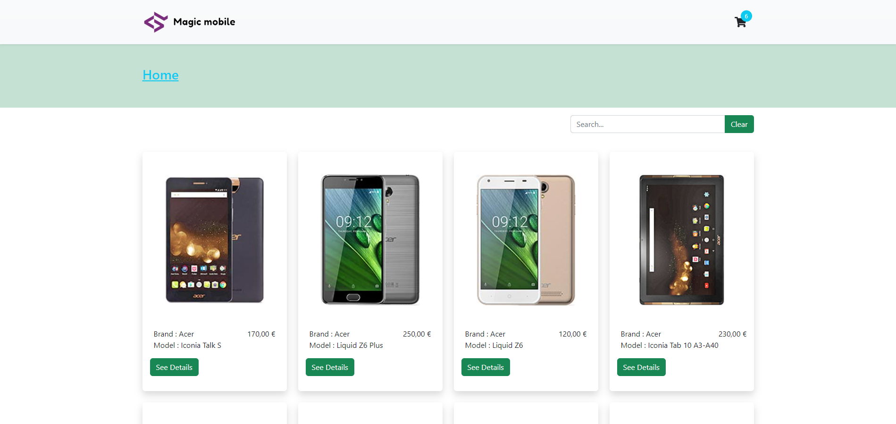
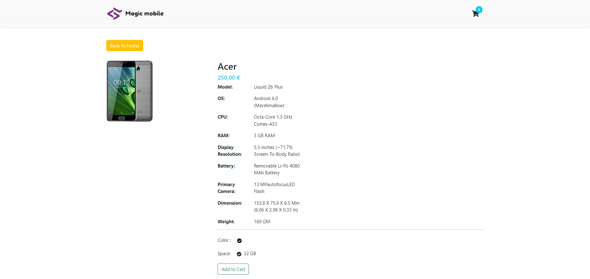

### <h2 style="text-align:center">E-Commerce-React-App</h2>

Shopping site project that includes basic processes such as adding to cart, product listing and product detail page, which should be on an e-commerce site.

  
- - -

### About the project

An e-commerce site with basic shopping functions.You can view all the available products go to the detail page of the relevant product, add the product to the cart, together with the captured product data.

The project was developed in conjunction with React.js, including Context, Hooks, and Life Cycles Methods. Styled with styled components and bootstrap.

### Built With

- React.js
- Bootstrap
- Axios
- External API
- Swal Alert

### Getting started

---

- fork the project and clone it locally.
- In the project directory, you can follow the steps below to download the dependencies:

  `npm install `

- In the project directory, you can run:

  `npm run`

### Usage

---

You can list the products by their model, additionally you can clear filter by clicking clear filter or just with backspaces.You can add product by your chosen color and storage.

### Roadmap

---

- [x] Fetching product data, search products and product detail page.
- [x] Add to cart.
- [x] Responsive Design.
- [ ] Add to cart and cart page.
- [ ] Complete the sign in and sign up process.
- [ ] Create order page.
- [ ] Add to favorites and favorites page.
